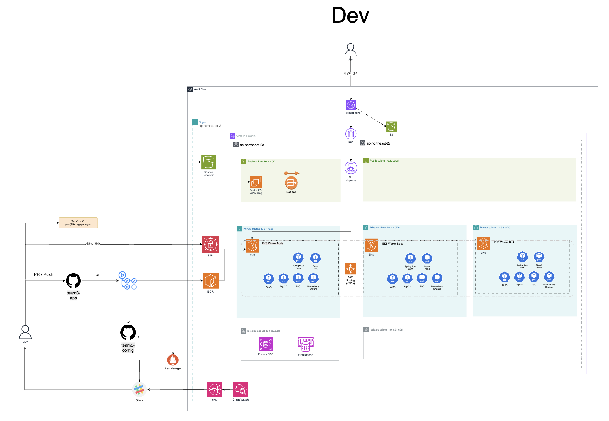
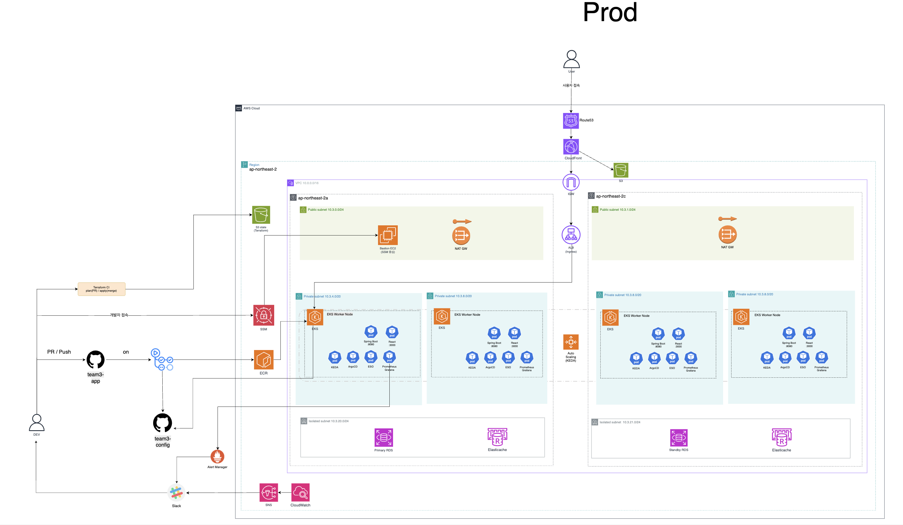

# 🥐🥨 맛난이 프로젝트 인프라 레포지토리

동네 기반 못난이 식품 거래 서비스 **맛난이(Matnani)** 의 AWS 인프라 저장소입니다.

Terraform으로 Dev/Prod 인프라를 관리하고, GitHub Actions OIDC와 ArgoCD를 이용해 애플리케이션을 배포합니다. Kubernetes 운영 컴포넌트와 애플리케이션 매니페스트의 소유권을 분리해 Terraform과 ArgoCD의 리소스 충돌을 방지합니다.

<hr style="border: 2px solid #000;">

## 🔗 관련 레포지토리

| 레포지토리 | 설명 |
|-----------|------|
| [team3-matnani-app](https://github.com/CLD-05/team3-matnani-app) | 프론트엔드 + 백엔드 소스 코드 |
| [team3-matnani-config](https://github.com/CLD-05/team3-matnani-config) | Kubernetes 매니페스트 (ArgoCD GitOps) |
| [team3-matnani-infra](https://github.com/CLD-05/team3-matnani-infra) | AWS 인프라 (Terraform) |

<br>

<hr style="border: 2px solid #000;">

## 🪜 아키텍처 다이어그램



<br>



<br>

<hr style="border: 2px solid #000;">


## 📁 레포지토리 구조

```text
team3-matnani-infra/
├── .github/workflows/
│   ├── terraform-plan.yml         
│   ├── terraform-apply.yml        
│   └── toggle-dev-nodes.yml       
├── grafana-dashboards/            
├── infra/
│   ├── bootstrap/                 
│   ├── modules/
│   │   ├── network/               
│   │   ├── eks/                   
│   │   ├── bastion/               
│   │   ├── database/             
│   │   ├── elasticache/          
│   │   ├── ecr/                  
│   │   ├── cloudfront/           
│   │   ├── github_oidc/          
│   │   ├── addons/               
│   │   ├── monitoring/           
│   │   └── k6/                   
│   └── envs/
│       ├── dev/
│       │   ├── infra/            
│       │   ├── platform-addons/  
│       │   └── fis/              
│       └── prod/
│           ├── infra/            
│           └── platform-addons/  
└── README.md
```

<br>
<hr style="border: 2px solid #000;">

## 📐 설계 원칙

- 모든 리소스 이름에 `team3-matnani-{env}` 접두사를 사용합니다.
- 모든 지원 리소스에 `Team`, `Project`, `Environment`, `ManagedBy` 태그를 적용합니다.
- Dev와 Prod의 Terraform state를 환경과 레이어별로 분리합니다.
- EKS 생성과 Helm 설치를 별도 레이어로 나눠 provider 초기화 실패를 방지합니다.
- AWS 자격 증명은 GitHub Actions OIDC 또는 로컬 AWS profile로 주입합니다.
- 비밀값은 SSM Parameter Store와 External Secrets Operator로 전달합니다.
- S3 원본은 퍼블릭 접근을 차단하고 CloudFront OAC를 통해 제공합니다.
- Prod 커스텀 도메인은 Route 53과 `us-east-1` ACM 인증서로 TLS를 적용합니다.

<hr style="border: 2px solid #000;">

## ⛏️ 기술 스택

| 영역 | 기술 |
| --- | --- |
| IaC | Terraform 1.15.x, AWS Provider 5.x |
| Cloud | AWS, `ap-northeast-2` |
| Network | VPC, Public/Private/Isolated Subnet, IGW, NAT Gateway |
| Compute | EKS 1.35, Managed Node Group, Bastion, k6 EC2 |
| Data | RDS MySQL 8.4, ElastiCache Redis 7.1 |
| Delivery | ECR, S3, CloudFront, ALB, Route 53, ACM |
| GitOps | GitHub Actions OIDC, ArgoCD |
| Platform | AWS Load Balancer Controller, ESO, metrics-server, KEDA, Cluster Autoscaler |
| Observability | Prometheus, Grafana, Alertmanager, CloudWatch, SNS, Amazon Q Developer |
| Resilience | AWS FIS, Multi-AZ, HPA/KEDA, Cluster Autoscaler |

<br>

<hr style="border: 2px solid #000;">

## 🔍 기술 선택 이유

### Backend

**1. MySQL 8 (RDS Multi-AZ)**

유저·상품·예약·후기가 JOIN으로 엮이는 관계형 구조이기 때문에 RDB를 사용합니다.

```
유저 ─── 상품 ─── 예약
         │
        후기 ─── 비밀댓글
```

예약 생성 시 재고 차감·상태 변경·알림이 하나의 트랜잭션으로 처리돼야 하므로 트랜잭션 보장이 필요합니다.

<br>

**2. Redis (ElastiCache)**

단순 캐싱 외에 Lua 스크립트 기반 동시성 제어가 필요해 Memcached 대신 Redis를 선택했습니다.
ElastiCache를 직접 Redis 서버 대신 사용하는 이유는 클러스터 장애 조치·모니터링을 AWS가 관리하기 때문입니다.

| 용도 | 설명 |
|------|------|
| 재고 동시성 제어 | Lua 스크립트로 GET → 검증 → DECRBY 원자 처리. 락 없이 동시 예약 요청을 처리 |
| JWT 블랙리스트 | 로그아웃 시 Access Token을 잔여 만료시간 TTL로 블랙리스트에 등록 |
| Refresh Token 관리 | Rotation 방식으로 Redis에 저장해 재사용을 방지 |
| 타임세일 Delayed Queue | 픽업 마감 2시간·1시간 전 자동 할인을 예약 |
| 행정동 코드 캐싱 | 정적 데이터로 DB 반복 조회가 불필요 |

<br>


**3. S3 + CloudFront**

해당 서비스는 판매글 등록 시 상품 이미지 업로드가 필수입니다. \
마감 임박 상품 특성상 단시간에 조회가 집중되므로 CloudFront CDN으로 원본 S3 부하를 줄이기 위해 도입했습니다.

<br>

---

### Infrastructure

**1. EKS (Kubernetes)**

| 비교 | 이유                                                                            |
|------|-------------------------------------------------------------------------------|
| EC2 대신 EKS | 예약 버튼 트래픽처럼 예측 불가능한 스파이크에 Pod 단위 스케일링이 유연합니다.                                 |
| ECS 대신 EKS | 마감 시간대 트래픽 급증 시 KEDA + HPA 조합으로 세밀한 오토스케일링이 가능하고, ArgoCD GitOps와 자연스럽게 연동됩니다. |


<br>

**2. Terraform**

AWS CDK·CloudFormation 대신 Terraform을 선택한 이유는 GitHub OIDC Provider처럼 AWS 외 리소스를 동일한 코드 안에서 관리할 수 있기 때문입니다.
동일한 모듈로 dev·prod 환경을 코드로 재현하고, S3 native state locking(v1.10+)으로 DynamoDB 없이 동시 수정을 방지합니다.

<br>


**3. GitHub Actions (OIDC) + ArgoCD**

| 비교 | 이유                                                          |
|------|-------------------------------------------------------------|
| Jenkins 대신 GitHub Actions | 별도 서버 운영 없이 app 레포와 같은 공간에서 CI를 관리할 수 있습니다.                 |
| Access Key 대신 OIDC | 키 유출 없이 GitHub Actions가 AWS에 직접 인증할 수 있습니다.                 |
| Helm 직접 배포 대신 ArgoCD | config repo를 단일 진실 공급원으로 삼아 드리프트를 방지하고, 배포 이력을 Git으로 추적합니다. |

<br>

**4. Prometheus + Grafana + KEDA**

K8s 내부 메트릭(Pod CPU·메모리·요청률)을 세밀하게 수집하려면 Prometheus가 필요합니다.
트래픽 과부하에 대비하여 KEDA로 Prometheus 메트릭 기반 Pod 오토스케일링을 연동합니다.

<br>

**5. AIOps (Bedrock Claude + Lambda)**

CloudWatch 알람 → Lambda → Claude 3 Haiku 분석 → Slack으로 전달합니다.
알람 원인과 조치 방안을 자동 요약해 on-call 대응 속도를 향상시킵니다.

<br>
<br>

<hr style="border: 2px solid #000;">


## 🌿 환경 구성 (Dev / Prod)

| 항목 | Dev | Prod |
| --- | --- | --- |
| VPC CIDR | `10.33.0.0/16` | `10.3.0.0/16` |
| Availability Zone | `ap-northeast-2a`, `ap-northeast-2c` | `ap-northeast-2a`, `ap-northeast-2c` |
| NAT Gateway | 1개 | 2개 |
| EKS Node | `t3.medium`, 최소 3개 | `m6i.large`, 최소 4개 |
| Node Scaling | 최대 4개 | 최대 8개 |
| RDS | `db.t4g.micro` | `db.m6i.large`, Multi-AZ, Read Replica |
| Redis | `cache.t4g.micro`, 단일 노드 | `cache.m7g.large`, 2노드 Failover |
| EKS API | Public + Private | Private 활성, Public 여부 변수 제어 |
| 서비스 주소 | CloudFront 기본 도메인 | `matnani.store` |
| 배포 | main 병합 시 자동 apply | 검토 후 수동 apply |

<hr style="border: 2px solid #000;">

## 🗄️ 상태 관리

S3 backend와 Terraform native lockfile을 사용합니다. DynamoDB lock table은 사용하지 않습니다.

```text
team3/dev/infra/terraform.tfstate
team3/dev/platform-addons/terraform.tfstate
team3/dev/fis/terraform.tfstate
team3/prod/infra/terraform.tfstate
team3/prod/platform-addons/terraform.tfstate
```

State bucket 이름은 각 환경의 `backend.tf`를 기준으로 확인합니다. `bootstrap`은 최초 1회만 적용하며, 이미 존재하는 GitHub OIDC Provider는 import 후 관리합니다.

<br>
<hr style="border: 2px solid #000;">

## 🔑 리소스 소유권

같은 Kubernetes 리소스를 Terraform과 ArgoCD가 동시에 관리하지 않도록 소유권을 구분합니다.

| 소유자 | 관리 대상 |
| --- | --- |
| Terraform | AWS 리소스, Helm release, Namespace, IRSA/IAM, ClusterSecretStore |
| Config Repository / ArgoCD | 애플리케이션 매니페스트, ExternalSecret, AlertmanagerConfig, ServiceMonitor, PrometheusRule |

`kube-prometheus-stack`은 Terraform이 설치하고, 실제 서비스 알람 규칙과 Slack 수신 설정은 Config Repository가 배포합니다.

<br>

<hr style="border: 2px solid #000;">

## 🔄 Terraform CI/CD

### 1. Pull Request

`infra/**` 변경 PR은 Dev plan을 실행하고 결과를 PR 본문에 남깁니다.

1. `dev/infra`
2. `dev/platform-addons`
3. `dev/fis`

<br>

### 2. Main 병합

`main`에 병합되면 Dev 레이어가 아래 순서로 자동 적용됩니다.

```text
dev/infra
├── dev/platform-addons
└── dev/fis
```

✲ Prod는 자동 apply 대상이 아닙니다. 운영 영향과 plan을 검토한 후 수동 적용합니다.

<br>

<hr style="border: 2px solid #000;">

## 📊 모니터링

### 1. Kubernetes 및 애플리케이션

```text
Prometheus → Alertmanager → Slack
```

- Pod/Node CPU 및 메모리
- Pod Pending, CrashLoopBackOff, 컨테이너 재시작
- 애플리케이션 응답 시간과 5xx 비율
- HPA/KEDA 및 Cluster Autoscaler 동작

---

### 2. AWS 관리형 리소스

```text
CloudWatch Alarm → SNS → Amazon Q Developer → Slack
```

- RDS CPU, 연결 수, 지연시간, 스토리지
- Redis CPU와 연결 수
- NAT 연결 수, 포트 할당 오류, 전송량
- ALB 응답시간, 요청 수, 4xx/5xx, Unhealthy Host
- EKS Node CPU와 메모리

Dev AIOps가 활성화된 경우 SNS 이벤트를 Lambda와 Amazon Bedrock이 분석해 별도 Slack 메시지로 전달합니다.


---

### 알람 임계값

| 항목 | Dev | Prod |
| --- | --- | --- |
| RDS CPU | 70% | 70% |
| RDS Storage | 20GB | 30GB |
| RDS Connections | 70 | 80 |
| RDS Read Latency | 150ms | 100ms |
| RDS Write Latency | 150ms | 120ms |
| EKS Node CPU | 70% | 70% |
| EKS Node Memory | 70% | 80% |
| Redis CPU | 50% | 70% |
| Redis Connections | 70 | 80 |
| ALB Request Count | 15k | 70k |
| ALB 4XX | 20 | 50 |
| ALB 5XX | 5 | 10 |
| NAT Connection | 40k | 50k |
| NAT Bytes Out | 5GB | 10GB |

<br>
<hr style="border: 2px solid #000;">

##  k6 부하 테스트 

`infra/modules/k6` 모듈은 k6 부하 테스트 전용 EC2 인스턴스를 관리합니다.

- Dev 클러스터 내 VPC에 EC2를 프로비저닝해 내부 ALB로 직접 트래픽을 발생시킵니다.
- 테스트 스크립트는 `k6/` 디렉토리에서 관리합니다.
- 테스트 결과는 Grafana k6 대시보드(`grafana-dashboards/`)에서 확인합니다.
- FIS 실험과 동시에 실행하지 않습니다.


🔗 [📄 부하 테스트 결과](docs/k6-result.md)


<hr style="border: 2px solid #000;">

##  카오스 엔지니어링 (AWS FIS)

FIS 시나리오:
````
1. EKS 노드 종료
2. RDS failover
3. CPU stress
4. Pod 강제 종료 
````


실험 전 확인 사항:
```
1. EKS 노드와 모니터링 스택이 정상 상태인지 확인합니다.
2. CloudWatch stop condition을 확인합니다.
3. 부하 테스트와 동시에 실행하지 않습니다.
4. 대상 리소스의 `Team`, `Environment` 태그를 확인합니다.
5. 실험 종료 후 Pod, Node, RDS, ALB와 Slack 알람의 복구 시간을 기록합니다.
```

🔗 [📄 카오스 엔지니어링 결과](docs/fis-result.md)

<hr style="border: 2px solid #000;">

## ❕ 보안 주의사항

- AWS Access Key와 Secret Key를 코드에 하드코딩하지 않습니다.
- `terraform.tfvars`, `.terraform/`, `tfplan`, `terraform.tfstate`를 커밋하지 않습니다.
- Slack Webhook, JWT Secret, DB 비밀번호, Grafana 비밀번호를 문서나 Actions 로그에 출력하지 않습니다.
- IAM Role은 `TeamRuntimeBoundary`를 적용하고 필요한 서비스 범위만 허용합니다.
- S3 frontend/image bucket은 Public Access Block과 CloudFront OAC를 사용합니다.
- CloudFront 커스텀 도메인 인증서는 `us-east-1` ACM에서 발급하고 Route 53 DNS 검증을 사용합니다.
- `terraform destroy`, Helm uninstall, state 변경 전 대상 환경과 kubectl context를 다시 확인합니다.
