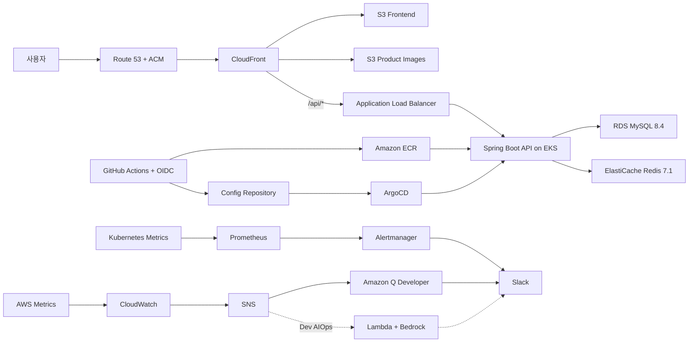

# Matnani Infrastructure

동네 기반 못난이 식품 거래 서비스 **맛난이(Matnani)** 의 AWS 인프라 저장소입니다.

Terraform으로 Dev/Prod 인프라를 관리하고, GitHub Actions OIDC와 ArgoCD를 이용해 애플리케이션을 배포합니다. Kubernetes 운영 컴포넌트와 애플리케이션 매니페스트의 소유권을 분리해 Terraform과 ArgoCD의 리소스 충돌을 방지합니다.

## Architecture



## Design Principles

- 모든 리소스 이름에 `team3-matnani-{env}` 접두사를 사용합니다.
- 모든 지원 리소스에 `Team`, `Project`, `Environment`, `ManagedBy` 태그를 적용합니다.
- Dev와 Prod의 Terraform state를 환경과 레이어별로 분리합니다.
- EKS 생성과 Helm 설치를 별도 레이어로 나눠 provider 초기화 실패를 방지합니다.
- AWS 자격 증명은 GitHub Actions OIDC 또는 로컬 AWS profile로 주입합니다.
- 비밀값은 SSM Parameter Store와 External Secrets Operator로 전달합니다.
- S3 원본은 퍼블릭 접근을 차단하고 CloudFront OAC를 통해 제공합니다.
- Prod 커스텀 도메인은 Route 53과 `us-east-1` ACM 인증서로 TLS를 적용합니다.

## Tech Stack

| 영역 | 기술 |
| --- | --- |
| IaC | Terraform 1.15.x, AWS Provider 5.x |
| Cloud | AWS, `ap-northeast-2` |
| Network | VPC, Public/Private/Isolated Subnet, IGW, NAT Gateway |
| Compute | EKS 1.35, Managed Node Group, Bastion, k6 EC2 |
| Data | RDS MySQL 8.4, ElastiCache Redis 7.1 |
| Delivery | ECR, S3, CloudFront, ALB, Route 53, ACM |
| GitOps | GitHub Actions OIDC, ArgoCD |
| Platform | AWS Load Balancer Controller, ESO, metrics-server, KEDA, Cluster Autoscaler |
| Observability | Prometheus, Grafana, Alertmanager, CloudWatch, SNS, Amazon Q Developer |
| Resilience | AWS FIS, Multi-AZ, HPA/KEDA, Cluster Autoscaler |

## Repository Structure

```text
team3-matnani-infra/
├── .github/workflows/
│   ├── terraform-plan.yml         # PR: Dev plan 및 결과 코멘트
│   ├── terraform-apply.yml        # main: Dev 자동 apply
│   └── toggle-dev-nodes.yml       # Dev 노드/NAT 비용 절감 토글
├── grafana-dashboards/            # 공통 Grafana 대시보드와 k6 연동 리소스
├── infra/
│   ├── bootstrap/                 # S3 backend, GitHub OIDC Provider
│   ├── modules/
│   │   ├── network/               # VPC, Subnet, IGW, NAT, Route Table
│   │   ├── eks/                   # EKS, Node Group, EKS Add-ons, Access Entry
│   │   ├── bastion/               # SSM 전용 Bastion
│   │   ├── database/              # RDS MySQL
│   │   ├── elasticache/           # Redis Replication Group
│   │   ├── ecr/                   # Backend image repository
│   │   ├── cloudfront/            # Frontend/Image S3, OAC, CloudFront
│   │   ├── github_oidc/           # App/Infra GitHub Actions IAM Role
│   │   ├── addons/                # EKS Helm releases
│   │   ├── monitoring/            # CloudWatch, SNS, Amazon Q, AIOps
│   │   └── k6/                    # 부하 테스트 EC2
│   └── envs/
│       ├── dev/
│       │   ├── infra/             # Dev AWS 기반 인프라
│       │   ├── platform-addons/   # Dev EKS 운영 컴포넌트
│       │   └── fis/               # Dev 장애 주입 실험
│       └── prod/
│           ├── infra/             # Prod AWS 기반 인프라, Route 53, ACM
│           └── platform-addons/   # Prod EKS 운영 컴포넌트
└── README.md
```

## Environment

| 항목 | Dev | Prod |
| --- | --- | --- |
| VPC CIDR | `10.33.0.0/16` | `10.3.0.0/16` |
| Availability Zone | `ap-northeast-2a`, `ap-northeast-2c` | 동일 |
| NAT Gateway | 실행 시 1개 | 실행 시 AZ별 1개 |
| EKS Node | `t3.medium`, CI 기준 3개 | `m6i.large`, 기본 4개 |
| Node Scaling | 최대 4개 | 최대 8개 |
| RDS | `db.t4g.micro` | `db.m6i.large`, Multi-AZ, Read Replica |
| Redis | `cache.t4g.micro`, 단일 노드 | `cache.m7g.large`, 2노드 Failover |
| EKS API | Public + Private | Private 활성, Public 여부 변수 제어 |
| 서비스 주소 | CloudFront 기본 도메인 | `matnani.store` |
| 배포 | main 병합 시 자동 apply | 검토 후 수동 apply |

환경별 값의 최종 기준은 각 `variables.tf`와 비공개 `terraform.tfvars`입니다.

## State Management

S3 backend와 Terraform native lockfile을 사용합니다. DynamoDB lock table은 사용하지 않습니다.

```text
team3/dev/infra/terraform.tfstate
team3/dev/platform-addons/terraform.tfstate
team3/dev/fis/terraform.tfstate
team3/prod/infra/terraform.tfstate
team3/prod/platform-addons/terraform.tfstate
```

State bucket 이름은 각 환경의 `backend.tf`를 기준으로 확인합니다. `bootstrap`은 최초 1회만 적용하며, 이미 존재하는 GitHub OIDC Provider는 import 후 관리합니다.

## Resource Ownership

같은 Kubernetes 리소스를 Terraform과 ArgoCD가 동시에 관리하지 않도록 소유권을 구분합니다.

| 소유자 | 관리 대상 |
| --- | --- |
| Terraform | AWS 리소스, Helm release, Namespace, IRSA/IAM, ClusterSecretStore |
| Config Repository / ArgoCD | 애플리케이션 매니페스트, ExternalSecret, AlertmanagerConfig, ServiceMonitor, PrometheusRule |

`kube-prometheus-stack`은 Terraform이 설치하고, 실제 서비스 알람 규칙과 Slack 수신 설정은 Config Repository가 배포합니다.

## Deployment Order

EKS API가 준비되기 전에 Helm/Kubernetes provider가 연결되는 문제를 피하기 위해 아래 순서를 지킵니다.

```text
1. bootstrap
2. envs/{env}/infra
3. envs/{env}/platform-addons
4. Config Repository의 ArgoCD root application
5. 애플리케이션 및 모니터링 sync 확인
```

## Prerequisites

- Terraform `>= 1.14.0, < 1.16.0`
- AWS CLI v2
- kubectl
- Helm
- AWS Session Manager Plugin
- 권한이 설정된 AWS profile과 MFA session
- SSM Parameter Store의 환경별 필수 파라미터

주요 SSM 경로는 다음 규칙을 사용합니다. 값 자체는 저장소에 기록하지 않습니다.

```text
/team3/matnani/{env}/db-username
/team3/matnani/{env}/db-password
/team3/matnani/{env}/grafana-password
/team3/matnani/{env}/monitoring/slack-webhook
```

Dev GitHub Actions에는 다음 Repository Variables가 필요합니다.

```text
SLACK_WORKSPACE_ID
SLACK_CHANNEL_ID
CHATBOT_ROLE_ARN
```

## Local Terraform Workflow

아래 예시는 Dev infra 기준입니다.

```powershell
aws sts get-caller-identity --profile final

Set-Location infra/envs/dev/infra
terraform init
terraform fmt -check -recursive
terraform validate
terraform plan -var-file="terraform.ci.tfvars" -out="tfplan"
terraform show -no-color "tfplan"
terraform apply "tfplan"
```

Prod는 저장소에 `terraform.tfvars`를 커밋하지 않습니다. 로컬 변수 파일과 실행 환경을 준비한 뒤, 반드시 저장된 plan을 검토하고 동일 plan 파일을 apply합니다.

```powershell
Set-Location infra/envs/prod/infra
terraform init
terraform validate
terraform plan -var-file="terraform.tfvars" -out="tfplan"
terraform apply "tfplan"
```

`-target`은 노드 비용 토글이나 장애 복구처럼 의도한 예외 상황에서만 사용합니다. 일반 배포는 전체 plan으로 drift와 누락 변경을 확인합니다.

## CI/CD

### Pull Request

`infra/**` 변경 PR은 다음 Dev plan을 실행하고 결과를 PR에 남깁니다.

1. `dev/infra`
2. `dev/platform-addons`
3. `dev/fis`

### Main Merge

`main`에 병합되면 Dev 레이어가 아래 순서로 자동 적용됩니다.

```text
dev/infra
├── dev/platform-addons
└── dev/fis
```

Prod는 자동 apply 대상이 아닙니다. 운영 영향과 plan을 검토한 후 승인된 작업자가 수동 적용합니다.

## Dev Cost Toggle

`Toggle Dev EKS Nodes` workflow는 `0`, `2`, `3`, `4`개 중 하나를 선택합니다.

- 종료: EKS Node Group을 먼저 0으로 축소한 뒤 NAT Gateway/EIP를 제거합니다.
- 복구: NAT Gateway를 먼저 생성한 뒤 EKS 노드를 생성합니다.
- 노드가 0개이면 EKS Control Plane은 유지되지만 Pod, ArgoCD, Grafana는 동작하지 않습니다.
- Node Group 외의 IAM, RDS, Redis, Bastion은 토글 대상이 아닙니다.

Prod는 토글 workflow를 사용하지 않습니다. `node_min`과 `node_desired`를 변경할 경우 NAT/EIP 및 NAT 기반 알람 변경이 함께 계획될 수 있으므로 전체 plan을 검토한 후 수동 적용합니다.

## Access And Verification

### EKS

```powershell
aws eks update-kubeconfig `
  --name team3-matnani-dev-eks `
  --region ap-northeast-2 `
  --profile final

kubectl config current-context
kubectl get nodes
kubectl get pods -A
```

Prod Public endpoint가 비활성화된 경우 VPC 내부 경로에서 EKS API에 접근해야 합니다.

### Bastion

```powershell
aws ssm start-session `
  --target i-xxxxxxxxxxxxxxxxx `
  --region ap-northeast-2 `
  --profile final
```

### Platform Add-ons

```powershell
helm list --all-namespaces
kubectl get pods -n argocd
kubectl get pods -n external-secrets
kubectl get pods -n monitoring
kubectl get clustersecretstore
```

### Grafana

```powershell
kubectl port-forward `
  svc/team3-matnani-kube-prometheus-stack-grafana `
  3000:80 `
  -n monitoring
```

브라우저에서 `http://localhost:3000`으로 접속합니다. 관리자 비밀번호는 환경별 SSM Parameter Store에서 관리합니다.

## Monitoring

### Kubernetes And Application

```text
Prometheus -> Alertmanager -> Slack
```

- Pod/Node CPU 및 메모리
- Pod Pending, CrashLoopBackOff, 컨테이너 재시작
- 애플리케이션 응답 시간과 5xx 비율
- HPA/KEDA 및 Cluster Autoscaler 동작

### AWS Managed Resources

```text
CloudWatch Alarm -> SNS -> Amazon Q Developer -> Slack
```

- RDS CPU, 연결 수, 지연시간, 스토리지
- Redis CPU와 연결 수
- NAT 연결 수, 포트 할당 오류, 전송량
- ALB 응답시간, 요청 수, 4xx/5xx, Unhealthy Host
- EKS Node CPU와 메모리

Dev AIOps가 활성화된 경우 SNS 이벤트를 Lambda와 Amazon Bedrock이 분석해 별도 Slack 메시지로 전달합니다.

## AWS FIS

Dev 환경의 FIS 레이어는 EKS 노드 종료, RDS failover, CPU stress, Pod 강제 종료 시나리오를 관리합니다.

실험 전 확인 사항:

1. EKS 노드와 모니터링 스택이 정상 상태인지 확인합니다.
2. CloudWatch stop condition을 확인합니다.
3. 부하 테스트와 동시에 실행하지 않습니다.
4. 대상 리소스의 `Team`, `Environment` 태그를 확인합니다.
5. 실험 종료 후 Pod, Node, RDS, ALB와 Slack 알람의 복구 시간을 기록합니다.

## Security Rules

- AWS Access Key와 Secret Key를 코드에 하드코딩하지 않습니다.
- `terraform.tfvars`, `.terraform/`, `tfplan`, `terraform.tfstate`를 커밋하지 않습니다.
- Slack Webhook, JWT Secret, DB 비밀번호, Grafana 비밀번호를 문서나 Actions 로그에 출력하지 않습니다.
- IAM Role은 `TeamRuntimeBoundary`를 적용하고 필요한 서비스 범위만 허용합니다.
- S3 frontend/image bucket은 Public Access Block과 CloudFront OAC를 사용합니다.
- CloudFront 커스텀 도메인 인증서는 `us-east-1` ACM에서 발급하고 Route 53 DNS 검증을 사용합니다.
- `terraform destroy`, Helm uninstall, state 변경 전 대상 환경과 kubectl context를 다시 확인합니다.

## Related Repositories

- Application: [`CLD-05/team3-matnani-app`](https://github.com/CLD-05/team3-matnani-app)
- Kubernetes Config: [`CLD-05/team3-matnani-config`](https://github.com/CLD-05/team3-matnani-config)
