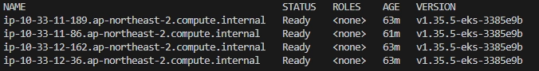
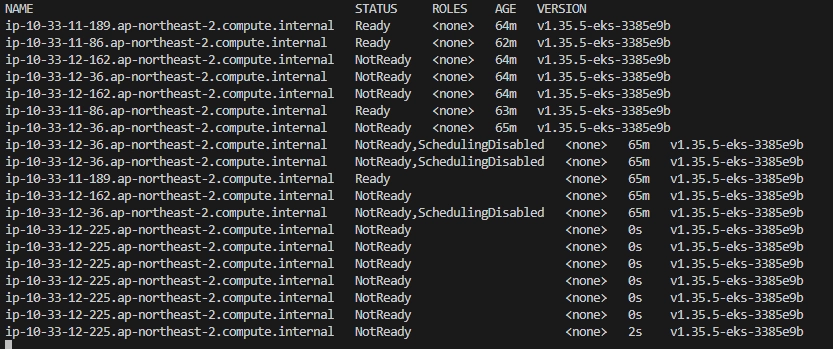
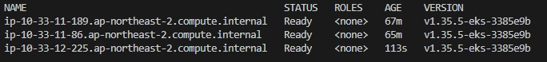
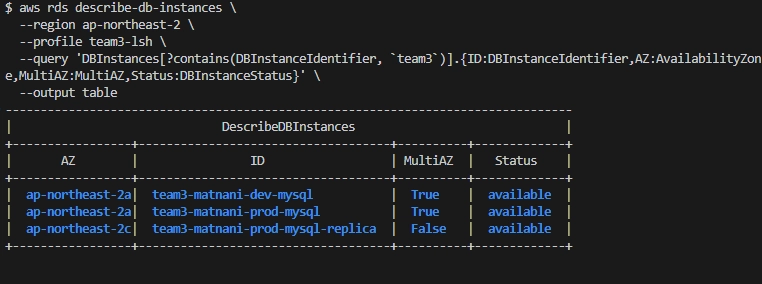
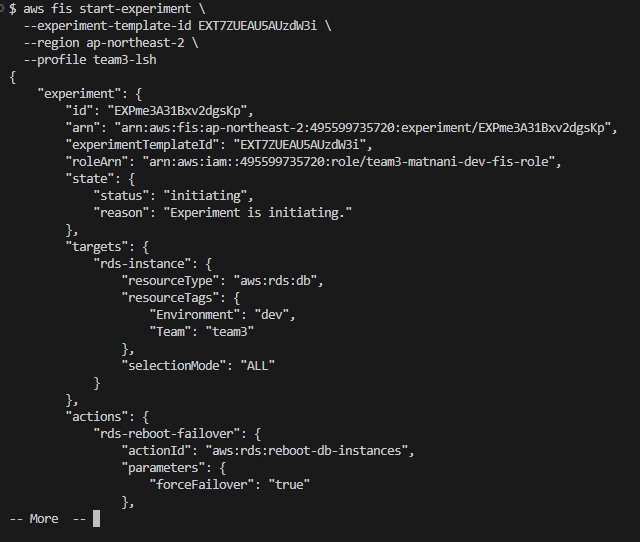
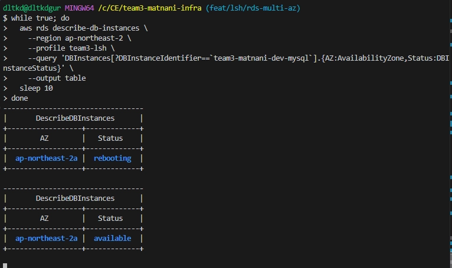
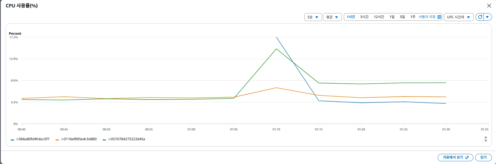
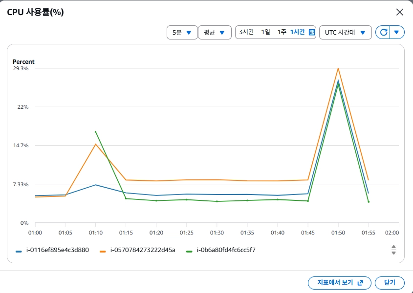
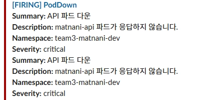
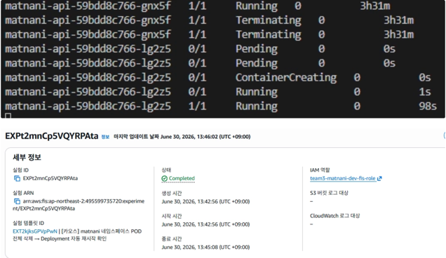

#  카오스 엔지니어링 결과 (AWS FIS)

---

## 실험 환경

| 항목 | 내용 |
| --- | --- |
| 환경 | Dev |
| 도구 | AWS Fault Injection Service (FIS) |
| IAM Role | `team3-matnani-dev-fis-role` (TeamRuntimeBoundary 적용) |
| Target 필터 | `Team=team3`, `Environment=dev` 태그 기반 |
| 모니터링 | Prometheus + Grafana, CloudWatch |

### Stop Condition

| 알람 | 조건 | 역할 |
| --- | --- | --- |
| `fis-eks-node-count` | 정상 노드 수 < 2 | EKS 노드 과도 종료 방지 |
| `fis-alb-5xx` | 5분간 5xx 에러 > 10건 | 서비스 장애 감지 |
| `fis-alb-p95-latency` | p95 응답 지연 > 3초 | 성능 저하 감지 |

 

## 실험 요약

| 시나리오 | 템플릿 ID | 실험 ID | 결과 | 복구 시간 |
| --- | --- | --- | --- | --- |
| EKS 노드 종료 (50%) | `EXTMWMu8LcWywuBW` | `EXPuwzGaCwMcEQSXjG` | ✅ 완료 | ~41초 |
| RDS Failover | `EXT7ZUEAU5AUzdW3i` | `EXPme3A31Bxv2dgsKp` | ✅ 완료 | AZ 전환 확인 |
| CPU 스트레스 | `EXTXk1fRP4tto12` | `EXPu9uzKREJvS2B8Tc` | ✅ 완료 | 60초 후 자동 복구 |
| Pod 강제 종료 | `EXT2kjksGPVpPwN` | `EXP9fQuHurENEPzwUe` | ✅ 완료 | ~98초 |

 

## 실험 1 — EKS 노드 종료

**목표**: 노드 종료 시 Cluster Autoscaler가 자동 복구하는지 확인

| 항목 | 내용 |
| --- | --- |
| 실험 전 | 노드 4개 Ready |
| 장애 주입 | `ip-10-33-12-36`, `ip-10-33-12-162` → NotReady, SchedulingDisabled |
| CA 복구 | `ip-10-33-12-225` 신규 노드 프로비저닝 |
| 복구 시간 | **약 41초** |
| 최종 상태 | 노드 4개 Ready (정상 복구) |

Cluster Autoscaler가 종료된 노드를 감지하고 자동으로 새 노드 프로비저닝 \
SchedulingDisabled 상태로 기존 Pod 드레인 후 종료되어 서비스 연속성 유지

 

### 🔭 실험 결과 

**실험 전** 

**장애 주입 중**

**복구 완료**

 

## 실험 2 — RDS Failover

**목표**: Multi-AZ Failover 시 Standby 자동 승격 및 서비스 영향 확인

| 항목 | 내용 |
| --- | --- |
| 실험 전 | Primary AZ: `ap-northeast-2a` |
| 장애 주입 | Primary 강제 재부팅 (`forceFailover: true`) |
| Failover | Standby(`ap-northeast-2c`) 자동 승격 |
| 실험 후 | Primary AZ: `ap-northeast-2c` |

Multi-AZ Standby가 자동으로 Primary로 승격 \
애플리케이션은 RDS Endpoint가 동일하게 유지되어 재연결 자동 처리

 

### 🔭 실험 결과

**실험 전 Primary AZ 확인**

**Failover 진행 중**

**실험 후 Primary AZ가 2c로 변경**

 

## 실험 3 — CPU 스트레스

**목표**: 노드 CPU 과부하 주입 후 자동 복구 확인

| 항목 | 내용 |
| --- | --- |
| 대상 노드 | `i-0116ef895e4c3d880`, `i-0570784273222d45a` (2개) |
| 장애 주입 | CPU 100% 부하 60초 (`AWSFIS-Run-CPU-Stress`, SSM Send Command) |
| 결과 | CPU 급등 확인 → 60초 후 자동 복구 |
| 최종 상태 | Completed |

- SSM Send Command를 통해 노드에 직접 CPU 스트레스 주입
- 부하 종료 후 CPU 정상 수치로 자동 복귀

 

### 🔭 실험 결과

**CPU 급등 그래프**

**60초 후 정상 복귀**

 

## 실험 4 — Pod 강제 종료

**목표**: Pod 삭제 시 Deployment 자동 복구 및 모니터링 알람 동작 확인

| 항목 | 내용 |
| --- | --- |
| 대상 | `matnani-api-59bdd8c766-gnx5f` (`team3-matnani-dev` 네임스페이스) |
| 장애 주입 | bastion SSM을 통해 kubectl로 Pod 강제 삭제 |
| 모니터링 알람 | Prometheus `PodDownSummary` 알람 발동 → Slack 전송 |
| 복구 | 새 Pod `lg2z5` 자동 생성 |
| 복구 시간 | **약 98초** |
| 최종 상태 | Completed |

- Pod 삭제 즉시 Prometheus 알람이 Slack으로 전송되어 모니터링 파이프라인 정상 동작 확인
- Deployment ReplicaSet이 자동으로 새 Pod를 프로비저닝하여 서비스 복구

 

### 🔭 실험 결과

**Pod 삭제 직후 Slack 알람**

**새 Pod 생성 완료**

 

## 종합 평가

| 실험 | 복구 시간      | 서비스 영향 | 평가 |
| --- |------------| --- | --- |
| EKS 노드 종료 | ~ 41초      | Pod 재스케줄링, 서비스 연속성 유지 | ✅ |
| RDS Failover | AZ 전환 확인   | Endpoint 유지로 자동 재연결 | ✅ |
| CPU 스트레스 | 60초 후 자동 복구 | CPU 급등 후 정상 복귀 | ✅ |
| Pod 강제 종료 | ~ 98초      | 알람 발동 + 자동 재생성 | ✅ |
