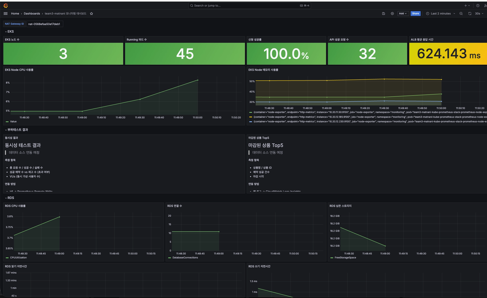
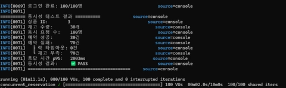
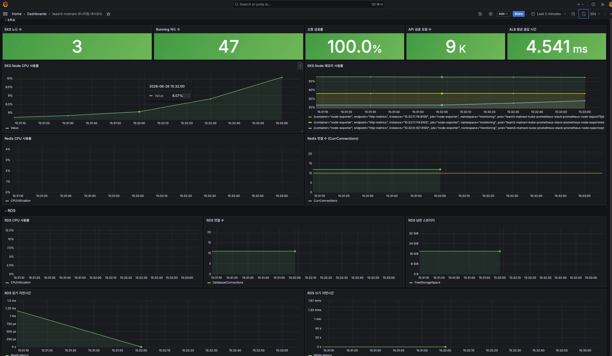
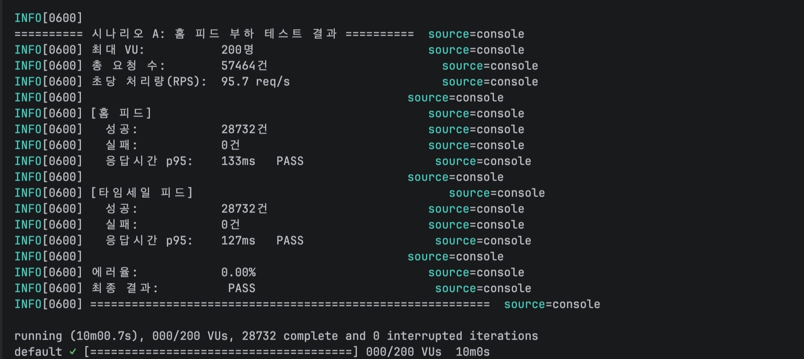
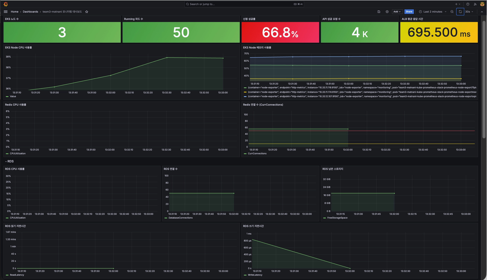
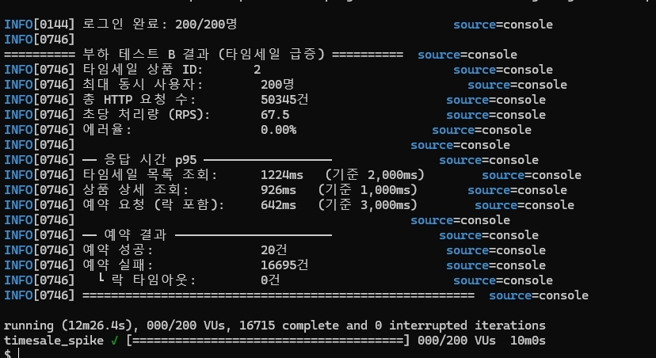
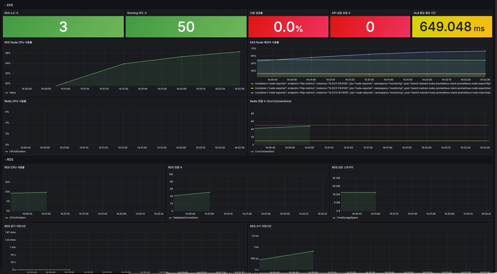
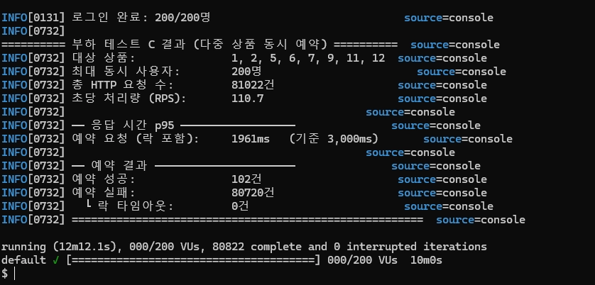
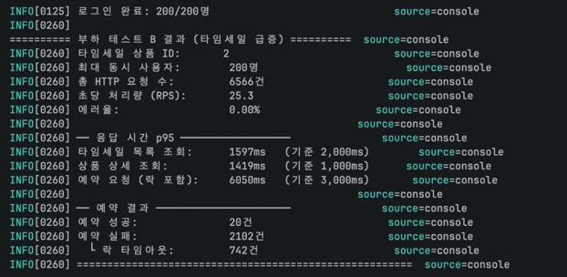

#  k6 부하 테스트 결과

<hr style="border: 2px solid #000;">


## 테스트 환경

| 항목 | 내용 |
| --- | --- |
| 실행 환경 | Dev VPC 내 k6 EC2 (`infra/modules/k6`) |
| 대상 | 내부 ALB → Spring Boot API |
| 스크립트 위치 | `team3-matnani-app/k6/` |


<br>

<hr style="border: 2px solid #000;">


## 시나리오

| 시나리오    | 내용                     | 설명                                                                                                                                                                | 인증 | 최대 VU |
|---------|------------------------|-------------------------------------------------------------------------------------------------------------------------------------------------------------------| --- | --- |
| 동시성 테스트 | 동시성 (분산 락 검증)          | 재고 N개짜리 상품 1개에 100명 동시 예약 — Redis 분산 락으로 재고 초과 예약 방지 검증                                                                                                           | 필요 (JWT) | 100 |
| 시나리오 A  | 마감 임박 피드 전체 상품 조회      | `GET /api/products/time-sale?regionId={id}` + `GET /api/products?sort=near_expiry` 반복 호출                                                                          | 불필요 | 200 |
| 시나리오 B  | 타임세일 상품 하나에 200명 동시 예약 | 200명 로그인 후 타임세일 목록 조회: `GET /api/products/time-sale?regionId=1866`<br/> 상품 상세 조회: `GET /api/products/2`<br/> 예약 요청 플로우: `POST /api/products/2/reservations` <br/> | 필요 (JWT) | 200 |
| 시나리오 C  | 다중 상품 동시 예약            | 200명 로그인 후 마감 임박 센션 상품을 랜덤 선택해 예약:  `POST /api/products/{id}/reservations`                                                                                        | 필요 (JWT) | 200 |


<br>

### 단계별 부하 

| 시나리오 | 구간 | 내용 |
| --- | --- | --- |
| A | 0→2m: 50 VU / 2→5m: 200 VU / 5→8m: 200 VU / 8→10m: 0 | 총 10분 |
| B | 0→1m: 50 VU / 1→3m: 200 VU / 3→8m: 200 VU / 8→9.5m: 50 VU / 9.5→10m: 0 | 총 10분 |
| C | 0→1m: 200 VU / 1→9m: 200 VU / 9→10m: 0 | 총 10분 |
| 동시성 | shared-iterations: 100 VU × 1회 | 최대 60초 |


<br>

### 임계값 (thresholds)

| 시나리오 | 지표 | 기준 |
| --- | --- | --- |
| 동시성 | `reservation_success` count | ≤ STOCK |
| 동시성 | `reservation_duration_ms` p95 | < 10000ms |
| 동시성 | `http_req_failed` rate | < 1% |
| A | `feed_duration_ms` p95 | < 500ms |
| A | `timesale_duration_ms` p95 | < 500ms |
| A | `error_rate` | < 1% |
| B | `timesale_list_ms` p95 | < 2000ms |
| B | `product_detail_ms` p95 | < 1000ms |
| B | `reservation_ms` p95 | < 3000ms |
| B | `error_rate` | < 5% |
| C | `reservation_duration_ms` p95 | < 3000ms |


<br>

<hr style="border: 2px solid #000;">


## 부하 테스트 결과

### 동시성 테스트 — Redis 분산 락 검증





<br>

| **항목**   | **결과** |
|----------| --- |
| 동시 요청    | 100명 |
| 재고 수량    | 30개 |
| 예약 성공    | **30건** |
| 예약 실패    | 70건 (재고 부족) |
| 예약 타임아웃  | **0건** |
| 응답시간 p95 | 2003ms |
| 동시성 결과   | **PASS** |

분석: 재고 정합성 달성. 재고 30개에 100명이 동시에 요청했을 때 성공이 정확히 30건으로 일치한다. 초과 예약(overselling)이 0건이며, 
이는 Lua 스크립트의 원자적 재고 차감이 정상 동작함을 확인해 준다.

<br>

---

### 시나리오 A — 홈 피드 부하 테스트





<br>

| **항목** | **결과** | **기준** | **판정** |
| --- | --- | --- | --- |
| 홈 피드 p95 | **133ms** | < 500ms | PASS |
| 타임세일 피드 p95 | **127ms** | < 500ms | PASS |
| 에러율 | **0.00%** | < 1% | PASS |
| 총 요청 | 57,464건 | — | — |
| RPS | 95.7 req/s | — | — |


분석: 홈 피드와 타임세일 피드 모두 기준치의 1/4 수준 응답시간을 유지하였다.

<br>

---

### 시나리오 B — 타임세일 급증





<br>

| **항목** | **결과** | **기준** | **판정** |
| --- | --- | --- | --- |
| 타임세일 목록 조회 p95 | **1,224ms** | < 2,000ms | ✅ |
| 상품 상세 조회 p95 | **926ms** | < 1,000ms | ✅ |
| 예약 요청 p95 | **642ms** | < 3,000ms | ✅ |
| 에러율 | **0.00%** | — | ✅ |
| 예약 성공 | **20건** | 재고 수량 | ✅ |
| 락 타임아웃 | **0건** | — | ✅ |
| RPS | 67.5 | — | — |

분석: 타임세일 급증 상황에서 재고 정합성·에러율·응답시간 모두 안정적이며, 
상품 상세 조회 응답시간만 여유가 적으므로 트래픽이 더 늘어날 경우 캐싱 도입을 고려할 만하다.

<br>

---

### 시나리오 C — 다중 상품 동시 예약





<br>

| **항목** | **결과** | **기준** |
| --- | --- | --- |
| 최대 동시 사용자 | 200명 | — |
| 총 HTTP 요청 | 81,022건 / 110.7 RPS | — |
| 응답시간 p95 | **1,961ms** | < 3,000ms ✅ |
| 예약 성공 | **102건** | 총 재고 102개 ✅ |
| 예약 실패 | 80,720건 (재고 소진) | — |
| 락 타임아웃 | **0건** | — |

분석: 다중 상품 조건에서도 재고 정합성, 타임아웃 제거, 응답시간 기준 모두 통과하였다.

<br>


<hr style="border: 2px solid #000;">


## 시나리오 B 병목 및 개선 사항

### 개선 1 — HPA · ArgoCD replicas 충돌 해소

HPA가 부하에 따라 Pod 수를 늘려도 ArgoCD가 Git에 선언된 `replicas` 값으로 되돌리는 충돌이 발생.
ArgoCD Application 설정에서 `Deployment`의 `/spec/replicas` 필드를 ignore하도록 수정해 해결하였다.

```
관측 결과
- HPA 기준: CPU 70%
- 부하 중 API CPU: 120~200% 수준
- API Pod 수: 3개 → 5개로 정상 증설
- HPA 이벤트: cpu resource utilization above target 사유로 scale out 발생
```

---
### 개선 2 — 부하 테스트 실행 시간 연장

기존 2분 30초 → 10분으로 변경해 워밍업 이후의 지속 부하 구간을 확보했다.

---

### 개선 3 — 백엔드 로직 수정

| 파일 | 변경 내용 |
| --- | --- |
| `RedissonConfig.java` | 커넥션 풀 추가: `connectionPoolSize=10`, `connectionMinimumIdleSize=5` |
| `ReservationService.java` | `tryLock(5, 10)` → `tryLock(2, 10)` (waitTime 단축) |

---

### 개선 4 — Lua 스크립트 도입

**기존 구조 (분산 락)**

```
200명 요청 → Redis 락 획득 대기 (직렬) → DB 재고 확인 → DB 재고 차감 + 예약 저장 → 락 해제
```

200명이 한 줄로 대기하는 구조로 락 경합·타임아웃·응답 지연이 발생했다.

<br>

**변경 후 (Lua 스크립트)**

```
200명 요청 → Redis에서 재고 확인 + 차감 (원자적, 병렬) → 성공한 요청만 DB 예약 저장
                                                         → 실패한 요청은 즉시 재고 없음 반환
```

- 락 제거 → 타임아웃 0건
- 병렬 처리 → 응답시간 대폭 감소
- Lua 원자성으로 재고 정합성 유지


<hr style="border: 2px solid #000;">

## 시나리오 B 개선 전∙후 비교
### 개선 전



### 개선 후 


<br>

| 지표 | 개선 전 | 개선 후 | 변화 |
| --- | --- | --- | --- |
| 총 요청 수 | 6,566건 | 50,345건 | +667% |
| RPS | 25.3 | 67.5 | +2.7배 |
| 타임세일 목록 p95 | 1,597ms ✅ | 1,224ms ✅ | -23% |
| 상품 상세 p95 | 1,419ms ❌ | 926ms ✅ | -35% |
| 예약 요청 p95 | 6,050ms ❌ | 642ms ✅ | -89% |
| 락 타임아웃 | 742건 | 0건 ✅ | 완전 해소 |
| 임계값 통과 | FAIL | PASS | — |

